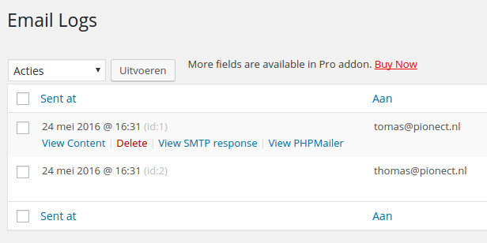
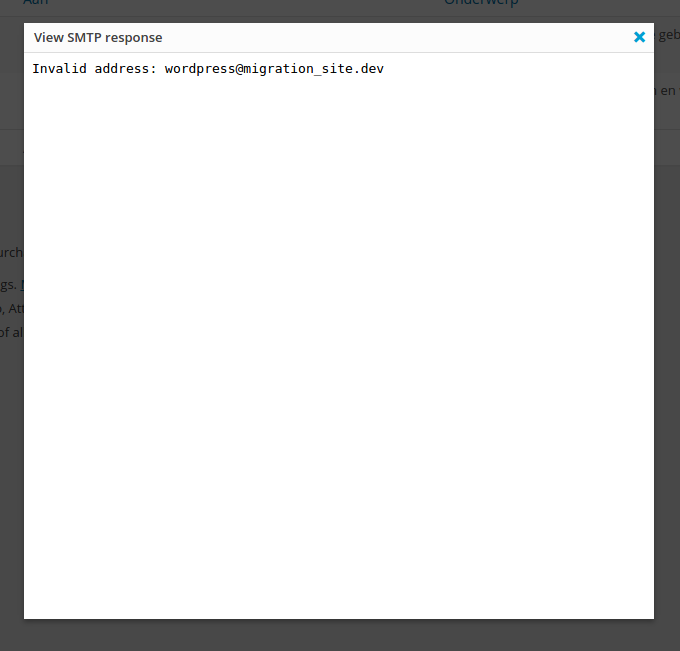
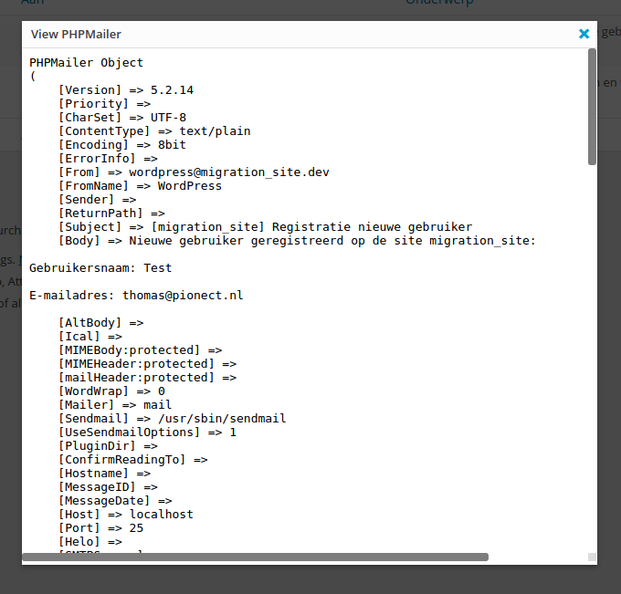

# Email Log Debug#
**Contributors:** Pionect
**Tags:** email, log, phpmailer, smtp response  
**Tested up to:** 4.5
**Stable tag:** 1.0  

An addon to Email Log Plugin, that allows you to see the result of wp_mail()

## Description ##

An addon to Email Log Plugin, that allows you to see the response of the SMTP server and the PHPMailer object.
For every logged email the SMTP response and PHPMailer object will be stored so you can debug issues with the delivery of emails. 

This plugin is an addon to the [Email Log](http://sudarmuthu.com/wordpress/email-log) WordPress Plugin.
You need to have the Email Log Plugin installed and activated for this plugin to work.

### Development

The development of the Plugin happens over at [github](https://github.com/Pionect/email-log-debug). If you want to contribute to the Plugin, [fork the project at github](http://github.com/sudar/email-log) and send me a pull request.

If you are not familiar with either git or Github then refer to this [guide to see how fork and send pull request](http://sudarmuthu.com/blog/contributing-to-project-hosted-in-github).

## Installation ##

#### Normal WordPress installations

Extract the zip file and just drop the contents in the wp-content/plugins/ directory of your WordPress installation and then activate the Plugin from Plugins page.

## Screenshots ##

This screenshot shows the action buttons added to a logged email

This screenshot shows a modal with an example of STMP response

This screenshot shows a modal with an example of a PHPMailer object
